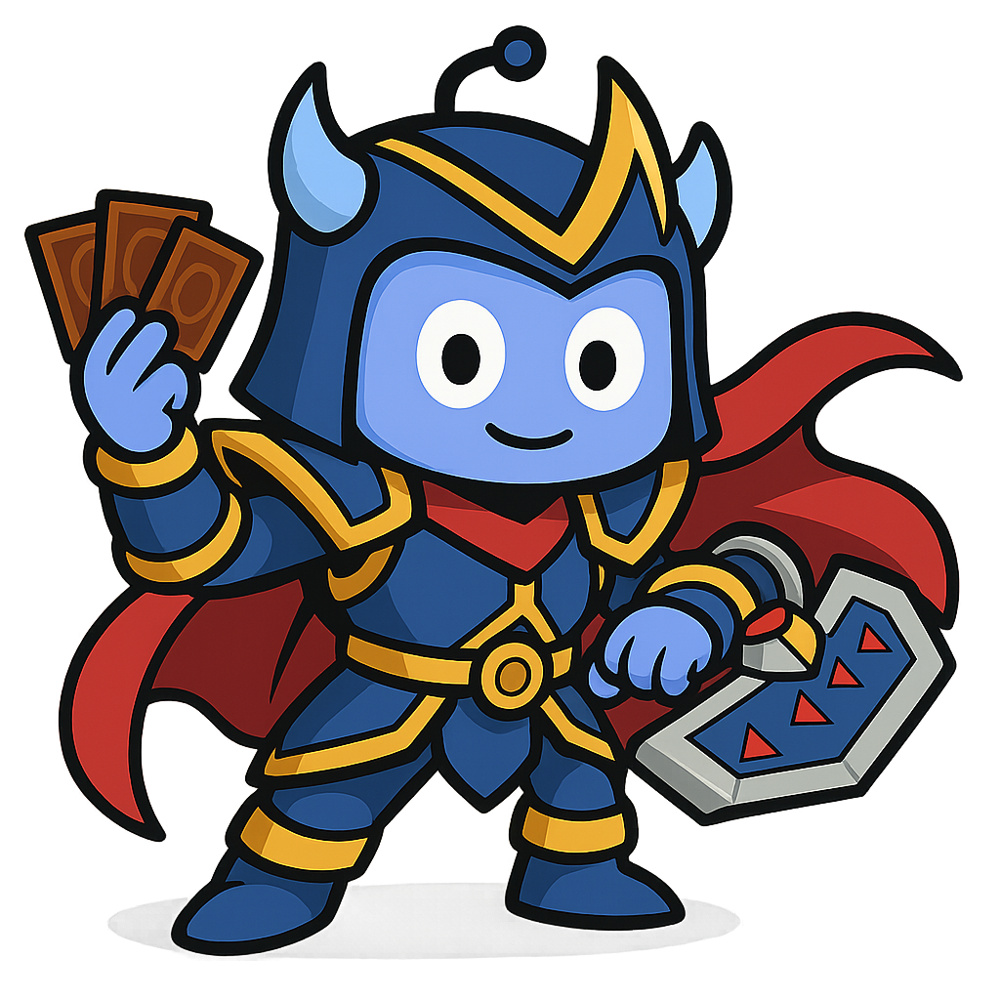
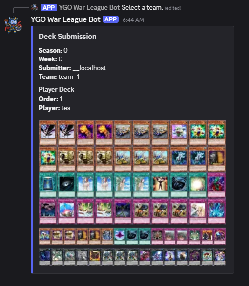
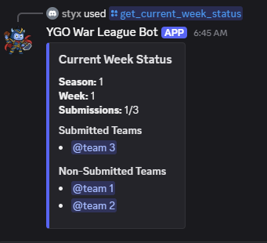

# YGO War League Bot

[](https://nedhmn.github.io/ygo-war-league-discord-bot/)
[](https://opensource.org/licenses/MIT)

A Discord bot designed to streamline deck submissions for Yu-Gi-Oh! war league events. It simplifies the organizational overhead for league administrators and provides a clear submission process for team captains.

<div align="center" style="margin-bottom: 20px">
    
</div>

## 🎮 Features

- **Effortless Deck Submission:** Team captains can submit and update decklists directly through intuitive Discord commands.
- **Robust YDK Validation:** Ensures submitted `.ydk` files adhere to a valid DuelingBook format.
- **Administrator Controls:** Dedicated commands for configuring league seasons and weeks, enabling/disabling submissions, and viewing submission data.
- **Automated Deck Image Generation:** Generates visual previews of submitted decks for easy review using PIL.
- **Local Data Storage:** Persistently stores submission data and generated deck images locally (SQLite3 database and file system by default).
- **Multi-Season and Multi-Week Support:** Flexible structure to manage ongoing league events across different seasons and weeks.
- **Dockerized for Easy Self-Hosting:** Simplified deployment and running the bot using Docker and Docker Compose.

## ✨ Features in Action

### Get Team Submission Preview



### Get Current Week Status



## 🚀 Getting Started

To self-host the YGO War League Bot, you will need Docker and Docker Compose installed.

### Clone the Repository

```bash
git clone https://github.com/nedhmn/ygo-war-league-discord-bot.git
cd ygo-war-league-discord-bot
```

### Configure Environmental Variables

Copy the `.env.example` file to `.env` and fill in the required values, including your Discord Bot Token and role IDs. Refer to the [Configuration section in the documentation](https://nedhmn.github.io/ygo-war-league-discord-bot/getting-started/configuration/) for detailed instructions.

### Build and Run with Docker Compose

```bash
docker compose build
docker compose up -d
```

The bot should come online in your Discord server. Check the [Running the Bot section in the documentation](https://nedhmn.github.io/ygo-war-league-discord-bot/getting-started/running-the-bot/) for troubleshooting steps.

## 📄 License

This project is licensed under the MIT License - see the [LICENSE](./LICENSE) file for details.
